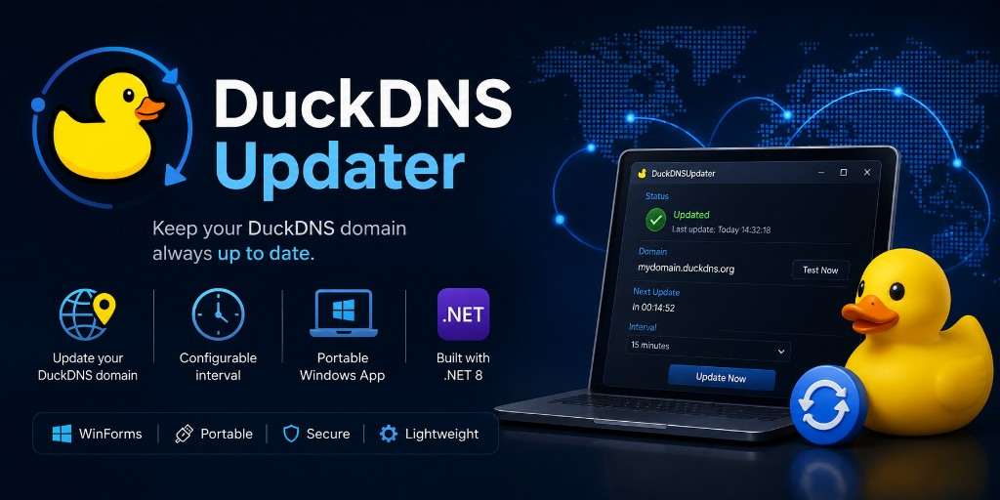
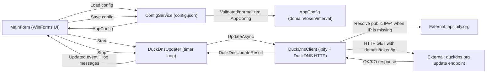

<p align="center">
  
</p>

# DuckDNS Updater

Portable Windows app (.NET 8 WinForms) that updates your DuckDNS domain on a configurable interval.

## Key features
- Portable Windows app (.NET 8 WinForms), published as a self-contained `win-x64` EXE.
- Configuration stored in `config.json` next to the EXE (created automatically on first start).
- Background scheduler that runs periodic updates and stops via cancellation.
- Public IPv4 resolution via `https://api.ipify.org` and DuckDNS updates via `https://www.duckdns.org/update`.
- UI status + log output, with optional file logging to `duckdns-updater.log`.

## Architecture


## Project structure
- `src/DuckDNSUpdater/`
  - `Program.cs` entry point
  - `MainForm.cs` WinForms UI (start/stop + status + log)
  - `Models/AppConfig.cs` persisted settings
  - `Services/ConfigService.cs` load/save + validation/normalization
  - `Services/DuckDnsUpdater.cs` periodic update loop
  - `Services/DuckDnsClient.cs` ipify + DuckDNS HTTP client
- `tests/DuckDNSUpdater.Tests/` xUnit unit tests + FlaUI-based UI smoke/E2E tests.

## Getting started
### Requirements

- Windows x64
- To build: [.NET 8 SDK](https://dotnet.microsoft.com/download/dotnet/8.0) or newer
- To run the published EXE: no installed .NET required (self-contained)

## Configuration (`config.json`)

Lives next to the EXE. On first start a template is created if the file is missing.

| Field | Meaning |
|------|-----------|
| `domain` | DuckDNS subdomain without `.duckdns.org` |
| `token` | DuckDNS account token |
| `intervalSeconds` | Update interval in seconds (min. 30, max. 86400) |
| `autoStart` | `true` starts the updater when the app launches |
| `writeLogsToFile` | `true` appends log lines to `duckdns-updater.log` next to the EXE |

Example:

```json
{
  "domain": "my-host",
  "token": "xxxxxxxx-xxxx-xxxx-xxxx-xxxxxxxxxxxx",
  "intervalSeconds": 300,
  "autoStart": false,
  "writeLogsToFile": false
}
```

## Usage

1. Enter domain and token
2. Set the interval in seconds
3. **Save** writes `config.json`
4. **Start** runs an update immediately and repeats on the interval
5. **Stop** ends the timer

While the updater is running, the input fields are locked. **Write logs to file** can be toggled at any time.

## Build & portable publish

```bash
dotnet build DuckDNSUpdater.sln -c Release
dotnet test DuckDNSUpdater.sln -c Release
dotnet publish src/DuckDNSUpdater -c Release -r win-x64 --self-contained true -p:PublishSingleFile=true
```

## Development and testing

Unit and E2E tests live in `tests/DuckDNSUpdater.Tests` (xUnit; FlaUI for UI smoke).
Output: `src/DuckDNSUpdater/bin/Release/net8.0-windows/win-x64/publish/`  
`config.json` is copied along.

## Deployment and operations
- Start the published `DuckDNSUpdater.exe` on Windows x64.
- `config.json` lives next to the EXE; on first start the app creates a template if the file is missing.
- The updater runs in the background while the UI is open.
- If `writeLogsToFile` is enabled, log lines are appended to `duckdns-updater.log`.

## Security, data, and limitations
### DuckDNS token handling
- The DuckDNS token is stored in `config.json`.
- During an update, the token is included in the DuckDNS HTTP request as the `token` query parameter.

### Logging
- The UI log shows status and the public IP address.
- The log lines do not include the token itself; the token is only used to build the DuckDNS URL.

### Public IP resolution
- The app resolves the public IPv4 address via `https://api.ipify.org`.
- Non-IPv4 responses are treated as invalid and the update is reported as failed.

### Interval validation
- `intervalSeconds` is validated to be within 30–86400 seconds.
- Domain normalization trims whitespace and removes a trailing `.duckdns.org` suffix if present.

### Network behavior
- The HTTP client uses a 30-second timeout.
- Network exceptions are surfaced to the UI as a “Network error” message.

## License and credits
This project is licensed under the [MIT License](LICENSE).

